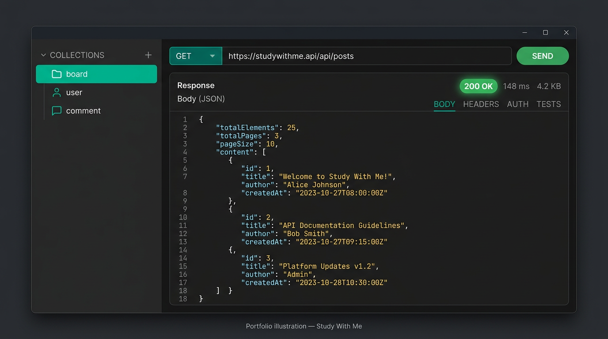

# 트러블슈팅 증빙 및 실측 캡처 (전체)

이 문서는 **실제로 발생할 수 있는 이슈**와, 저장소에 첨부한 **Postman·터미널·HTTP 캡처**를 한곳에 모은 것입니다.  
**직접 찍은 Postman 스크린샷**은 [`evidence/screenshots/README.md`](./evidence/screenshots/README.md) 를 참고해 `evidence/screenshots/` 에 추가하면 됩니다.  
저장소에는 문서용 **예시 이미지(PNG)** 와 **벡터(SVG)** 를 함께 두었습니다.



*위 이미지는 포트폴리오 설명용 일러스트이며, 실제 Postman 화면과 다를 수 있습니다. 실제 검증 화면은 Postman에서 Import 후 직접 캡처하세요.*

---

## 1. 첨부 파일 인덱스 (바로 Import)

| 종류 | 파일 |
|------|------|
| Postman 컬렉션 | [`evidence/postman/StudyWithMe-Backend.postman_collection.json`](./evidence/postman/StudyWithMe-Backend.postman_collection.json) |
| Postman 환경 | [`evidence/postman/StudyWithMe-Backend.postman_environment.json`](./evidence/postman/StudyWithMe-Backend.postman_environment.json) |
| VS Code REST Client | [`evidence/http/studywithme-api.http`](./evidence/http/studywithme-api.http) |
| 터미널/HTTP 텍스트 캡처 | [`evidence/captures/`](./evidence/captures/) |
| 증빙 폴더 설명 | [`evidence/README.md`](./evidence/README.md) |

Postman에서 **Import → 파일 선택** 후, 환경의 `baseUrl`을 본인 서버 포트에 맞게 바꾸면 동일 시나리오를 재현할 수 있습니다.

---

## 2. HTTP 실측 캡처 (로컬 서버, `devh2`, 포트 8082)

> 캡처 시각: 2026-03-30. DB는 인메모리 H2라 **게시글이 0건**인 상태가 정상입니다.  
> 원본 전체: `evidence/captures/01-*.txt` … `07-*.txt`

### 2.1 `GET /api/posts` — 200, 빈 Page

**증빙 파일:** [`evidence/captures/01-get-api-posts.txt`](./evidence/captures/01-get-api-posts.txt)

```http
HTTP/1.1 200
Content-Type: application/json

{"content":[],"pageable":{...},"totalElements":0,"totalPages":0,"empty":true}
```

**포트폴리오 팁:** Postman에서 동일 요청을 보낸 뒤 **Status 200**과 **Body** 탭을 캡처해 `evidence/screenshots/postman-get-api-posts-200.png` 로 저장.

### 2.2 `GET /api/notifications/unread-count` — 비로그인

**증빙 파일:** [`evidence/captures/02-get-notifications-unread-count.txt`](./evidence/captures/02-get-notifications-unread-count.txt)

```json
{"count":0}
```

### 2.3 `GET /api/recommendations/posts?size=3` — 데이터 없음 시 빈 배열

**증빙 파일:** [`evidence/captures/03-get-recommendations-posts.txt`](./evidence/captures/03-get-recommendations-posts.txt)

```json
[]
```

### 2.4 `GET /api/posts/1/comments` — 댓글 없음

**증빙 파일:** [`evidence/captures/04-get-comments-post-1.txt`](./evidence/captures/04-get-comments-post-1.txt)

```json
[]
```

### 2.5 `POST /api/posts/ai-tags` — Python 동작 시 200 (인코딩은 터미널에 따라 깨질 수 있음)

**증빙 파일:** [`evidence/captures/05-post-ai-tags.txt`](./evidence/captures/05-post-ai-tags.txt)

- `devh2`에서도 스크립트가 돌면 태그·카테고리 필드가 채워질 수 있음.
- 터미널/콘솔 **코드 페이지**에 따라 한글이 깨져 보이면, Postman **Pretty** JSON으로 확인하거나 UTF-8로 파일을 다시 저장.

### 2.6 `POST /api/chatbot/message` — Gemini API 키 무효 (트러블슈팅 대표 사례)

**증빙 파일:** [`evidence/captures/06-post-chatbot-message.txt`](./evidence/captures/06-post-chatbot-message.txt)

- **HTTP 200**이지만 본문에 오류 메시지가 포함되는 패턴 (프론트 호환용 설계).
- 예시 키워드: `API key not valid`, `valid API key`.

**조치:** `application-local.properties` 또는 `.env`의 `gemini.api.key` 확인 → Postman으로 재호출 → **성공/실패 화면 스크린샷**을 나란히 첨부하면 트러블슈팅 스토리가 됩니다.

### 2.7 포트 8080 점유 — `netstat` 샘플

**증빙 파일:** [`evidence/captures/07-netstat-port-8080-sample.txt`](./evidence/captures/07-netstat-port-8080-sample.txt)

```text
TCP    0.0.0.0:8080    0.0.0.0:0    LISTENING    24808
TCP    [::]:8080       [::]:0       LISTENING    24808
```

**조치:** 해당 PID 종료 또는 `bootRun --args="--server.port=8082"`.

---

## 3. Gradle / 경로 관련 (텍스트 증빙 권장)

| 이슈 | 증빙 방법 |
|------|-----------|
| 한글 경로에서 `gradlew test` 실패 | `subst W:` 후 `W:\`에서 실행한 터미널 로그 캡처 → `screenshots/terminal-subst-w-drive.png` |
| `bootRun` 포트 충돌 | Spring Boot 로그 + 위 `netstat` 캡처 |

---

## 4. 사진(스크린샷) 체크리스트

`evidence/screenshots/`에 다음을 넣으면 **문서 + 이미지** 세트가 완성됩니다.

1. Postman 컬렉션 Import 후 전체 트리  
2. `GET /api/posts` — 200 + JSON Body  
3. `POST /auth` — Response Headers의 `Set-Cookie: JSESSIONID`  
4. 로그인 후 `POST .../comments` — 성공 또는 `로그인이 필요합니다`  
5. 챗봇 API 키 오류 시 Body (위 2.6과 동일 화면)  
6. `BUILD SUCCESSFUL` 터미널

---

## 5. 문서용 시각 자료 (PNG 대체)

- [`evidence/illustration-api-client.svg`](./evidence/illustration-api-client.svg): 컬렉션·요청줄·200·JSON 패널을 **다이어그램**으로 표현 (실제 스크린샷 아님).

Markdown·Notion·GitHub에서 SVG가 막히면 브라우저로 SVG를 연 뒤 스크린샷을 찍어 PNG로 써도 됩니다.
